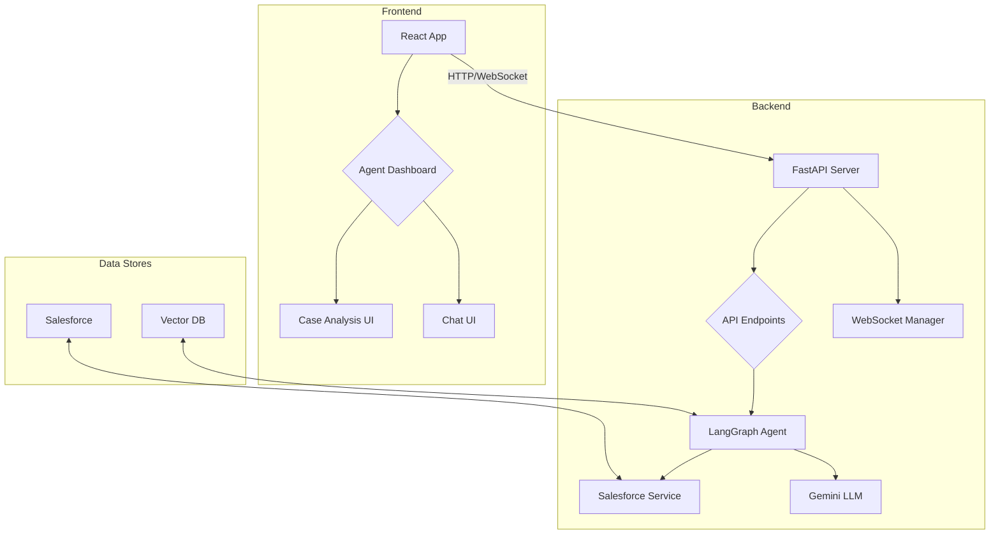

# Customer 360 Copilot

An AI-powered Salesforce Customer 360 case management copilot designed to enhance agent productivity and streamline case resolution. This project leverages advanced AI techniques, including LangGraph for agentic workflows, RAG/KAG pipelines for contextual understanding, and a modern React/TypeScript frontend for an intuitive user experience.

 <!-- Replace with actual screenshot -->

## Table of Contents

- [Features](#features)
- [System Architecture](#system-architecture)
- [Project Structure](#project-structure)
- [Getting Started](#getting-started)
  - [Prerequisites](#prerequisites)
  - [Installation](#installation)
  - [Configuration](#configuration)
- [Usage](#usage)
- [Technology Stack](#technology-stack)
- [API Endpoints](#api-endpoints)
- [Future Improvements](#future-improvements)

## Features

- **AI-Powered Case Analysis**: Utilizes LangGraph and Google Gemini to analyze Salesforce cases, providing summaries, identifying root causes, and suggesting next actions.
- **RAG/KAG Pipelines**: Implements Retrieval-Augmented Generation (RAG) and Knowledge-Augmented Generation (KAG) for deep contextual understanding of cases and related Salesforce objects.
- **Chain-of-Thought (CoT) Prompting**: Employs CoT reasoning to provide transparent and detailed analysis, showing the AI's thought process.
- **Automated Summary & Sanitization**: Generates both a raw, detailed summary and a sanitized version for customer-facing communication, automatically removing sensitive data.
- **Agent Assignment Recommendations**: Suggests the best-suited agents for a case based on skills, workload, and availability.
- **Real-Time Chat Interface**: A WebSocket-based chat for seamless communication between agents and (in future versions) users.
- **Modern Tech Stack**: Built with FastAPI for the backend, React+TypeScript for the frontend, and Docker for containerization.

## System Architecture

The application is designed with a microservices-oriented architecture, separating the frontend and backend for scalability and maintainability.



## Project Structure

```
/customer360-copilot
├── backend/
│   ├── app/
│   │   ├── api/            # API routes and WebSocket handler
│   │   ├── core/           # Configuration, auth, etc.
│   │   ├── data/           # Static data files (JSON, CSV)
│   │   ├── models/         # Pydantic schemas
│   │   ├── prompts/        # CoT prompt templates
│   │   ├── services/       # Business logic (Salesforce, LangGraph agent)
│   │   └── main.py         # FastAPI app entrypoint
│   ├── tests/              # Pytest unit tests
│   ├── Dockerfile
│   └── requirements.txt
├── frontend/
│   ├── src/
│   │   ├── components/     # Reusable UI components
│   │   ├── hooks/          # Custom React hooks
│   │   ├── pages/          # Page components (Dashboard, Login)
│   │   ├── services/       # API and WebSocket services
│   │   ├── stores/         # Zustand state management
│   │   ├── types/          # TypeScript type definitions
│   │   └── App.tsx         # Main app component with routing
│   ├── Dockerfile
│   └── package.json
├── .gitignore
├── docker-compose.yml
└── README.md
```

## Getting Started

### Prerequisites

- **Docker and Docker Compose**: Ensure you have Docker and Docker Compose installed on your system.
- **Salesforce Account**: A Salesforce developer account is required to connect to the Salesforce API. You'll need your username, password, and security token.
- **Google API Key**: A Google Cloud project with the Gemini API enabled. You can get an API key from the [Google AI Studio](https://aistudio.google.com/).

### Installation

1.  **Clone the repository:**

    ```bash
    git clone https://github.com/your-username/customer360-copilot.git
    cd customer360-copilot
    ```

2.  **Create environment files:**

    -   **Backend:** Create a `.env` file in the `backend/` directory by copying `.env.example`:

        ```bash
        cp backend/.env.example backend/.env
        ```

    -   **Frontend:** The frontend is configured to use the backend proxy, so no `.env` file is needed for default setup.

### Configuration

Open `backend/.env` and fill in the required credentials:

```env
# Salesforce Configuration
SALESFORCE_USERNAME=your_salesforce_username
SALESFORCE_PASSWORD=your_salesforce_password
SALESFORCE_SECURITY_TOKEN=your_salesforce_security_token
SALESFORCE_DOMAIN=login  # or 'test' for sandbox

# Google Gemini API
GOOGLE_API_KEY=your_google_api_key

# JWT Configuration (change for production)
JWT_SECRET_KEY=a-very-secret-key
```

## Usage

1.  **Run the application with Docker Compose:**

    ```bash
    docker-compose up --build
    ```

2.  **Access the application:**

    -   **Frontend (Agent Dashboard)**: [http://localhost:3000](http://localhost:3000)
    -   **Backend API Docs**: [http://localhost:8000/docs](http://localhost:8000/docs)

3.  **Login:**

    -   For this Proof of Concept, you can use any username and password to log in. Select the `Agent` role to access the dashboard.

4.  **Analyze a Case:**

    -   Enter a Salesforce Case ID in the input field and click "Analyze".
    -   The AI agent will fetch case data, analyze it, and display the summary, next actions, and other insights.

## Technology Stack

- **Backend**: Python, FastAPI, LangChain, LangGraph, Google Gemini, Uvicorn
- **Frontend**: React, TypeScript, Vite, Tailwind CSS, Zustand, React Query
- **Database**: ChromaDB (for vector storage), Salesforce
- **Containerization**: Docker, Docker Compose

## API Endpoints

- `POST /api/v1/auth/token`: Authenticate and get a JWT token.
- `POST /api/v1/cases/analyze`: Analyze a Salesforce case.
- `GET /api/v1/agents/available`: Get a list of available agents.
- `POST /api/v1/cases/{case_id}/notify-agents`: Send a summary to selected agents.
- `GET /ws/{role}/{user_id}`: WebSocket endpoint for real-time chat.

## Future Improvements

- **Full KAG Implementation**: Integrate a vector database (ChromaDB) to store and retrieve case knowledge for the KAG pipeline.
- **User-Facing Chatbot**: Develop the user-facing chatbot interface for logging and interacting with cases.
- **Real-time Case Updates**: Use WebSockets to push real-time case updates to the agent dashboard.
- **Advanced Agent Assignment**: Enhance the agent assignment logic with more sophisticated matching algorithms.
- **Production-Ready Deployment**: Add comprehensive logging, monitoring, and a more robust deployment setup (e.g., Kubernetes).
