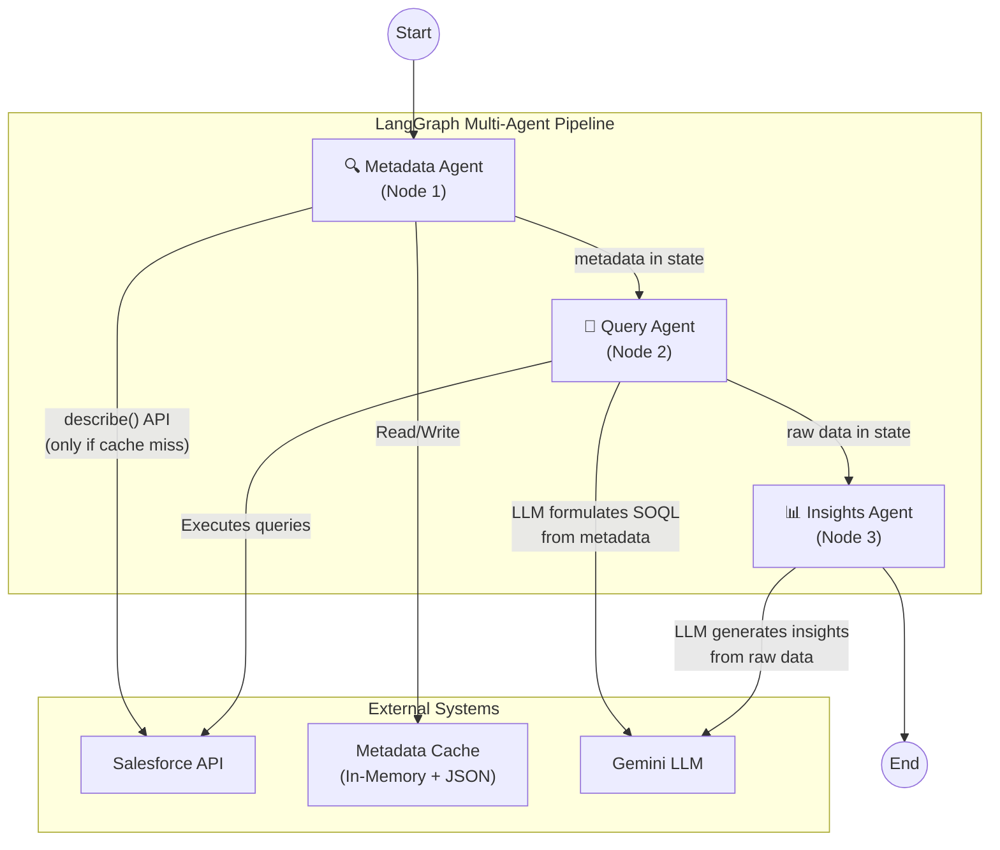

# Sales Rep Account Summary — Multi-Agent Architecture

The feedback requires a **Sales Rep Account Summary** providing:
1. Activity summary — who they've spoken with and topics discussed  
2. Recent cases (90 days) — with trend analysis (credit requests, ordering issues, login issues)

Instead of hardcoding Salesforce fields in SOQL queries, we'll build a **metadata-driven, multi-agent pipeline** using LangGraph that:
- **Dynamically discovers** Salesforce object schemas via the `describe()` API
- **Caches metadata** to avoid redundant Salesforce calls  
- Uses **specialized agents** (nodes) that each own a clear responsibility
- Passes a shared state through the pipeline to avoid repeated data fetching

---

## Architecture Overview



### Agent Responsibilities

| Agent | Responsibility | SF Calls | LLM Calls |
|---|---|---|---|
| **Metadata Agent** | Fetch & cache object `describe()` for Task, Event, Case, Contact, Account. Filter to queryable fields. Persist to JSON. | Only on cache miss | None |
| **Query Agent** | Given cached metadata + account ID + date range, use LLM to formulate dynamic SOQL queries for activities, cases, contacts. Execute queries against SF. | Executes SOQL | 1 call to formulate queries |
| **Insights Agent** | Given raw data from Query Agent, generate Sales Rep summary with contact history, case trends, key takeaways. | None | 1–N calls (batch if large) |

### Key Design Decisions

1. **Metadata Cache** — Stored in-memory (TTL-based dict) with a JSON file fallback on disk under `backend/app/data/metadata_cache/`. On startup, the cache loads from disk. On cache miss, it calls `sf.Object.describe()` and persists. TTL = 24 hours (configurable).

2. **LLM-Generated SOQL** — The Query Agent provides the LLM with the metadata schema (field names, types, labels) and asks it to produce the optimal SOQL query. This means **zero hardcoded field names** — the system adapts to whatever fields exist in the org.

3. **Shared State** — A `TypedDict` flows through all 3 nodes. Each agent reads what it needs and writes its output back to the state, so no redundant fetching.

---

## User Review Required

> [!IMPORTANT]
> **Metadata Cache Location** — I plan to store the metadata cache JSON files under `backend/app/data/metadata_cache/`. This directory will be gitignored since it's org-specific. On first run per object, there will be a one-time describe() call. Is this acceptable, or do you prefer a different location (e.g., a Redis/DB cache)?

> [!WARNING]
> **LLM-Generated SOQL Safety** — The Query Agent will ask the LLM to write SOQL queries based on the metadata. While SOQL is read-only, there's a small risk of the LLM producing malformed queries. I'll add validation (check for DML keywords, parse the query structure) before executing. The LLM will receive strict output format instructions with a JSON schema for the queries.

> [!IMPORTANT]
> **Which SF Objects to Describe** — I'll start with: `Task`, `Event`, `Case`, `Contact`, `Account`. These cover activities (Tasks/Events), cases, and contact info. Do you want any additional objects (e.g., `Opportunity`, `Order`) included in the metadata discovery?

## Open Questions

1. **Cache TTL** — 24 hours seems reasonable for field metadata (schemas rarely change). Would you prefer a different interval, or a manual "refresh metadata" button in the UI?

2. **LLM for SOQL vs Template Queries** — For the query formulation, the LLM can dynamically adapt but adds ~1-2s latency and a small cost. An alternative is to use the LLM once to generate query templates on first run, then cache those templates. Which approach do you prefer?

3. **Streaming Progress** — The 3-agent pipeline can take 10-30s. Should the frontend show step-by-step progress (e.g., "Discovering schema...", "Fetching data...", "Generating insights...") via WebSocket or is a single loading spinner sufficient?

---

## Proposed Changes

### Backend — New: Metadata Cache Service

#### [NEW] [metadata_cache.py](file:///c:/Projects/Ashok/Customer360-copilot/customer360-copilot/backend/app/services/metadata_cache.py)

A standalone caching layer for Salesforce object metadata:

```python
class MetadataCache:
    """In-memory + disk-persisted cache for SF object describe() metadata"""
    
    CACHE_DIR = "app/data/metadata_cache"
    DEFAULT_TTL_HOURS = 24
    OBJECTS_TO_CACHE = ["Task", "Event", "Case", "Contact", "Account"]
    
    def get_object_metadata(self, object_name: str) -> dict:
        """Returns cached metadata or fetches fresh via describe()"""
        
    def get_queryable_fields(self, object_name: str) -> list[dict]:
        """Returns only queryable fields with name, label, type, referenceTo"""
        
    def get_relationship_fields(self, object_name: str) -> list[dict]:
        """Returns relationship (lookup/master-detail) fields"""
    
    def refresh_cache(self, object_name: str = None):
        """Force-refresh cache for one or all objects"""
    
    def warm_cache(self):
        """Pre-populate cache for all configured objects on startup"""
```

Key behaviors:
- On `get_object_metadata()`: checks in-memory dict → disk JSON → SF describe() API
- Stores field name, label, type, length, referenceTo, isQueryable, isFilterable
- Filters out non-queryable and compound fields
- Thread-safe with a simple lock

---

### Backend — New: Multi-Agent Pipeline Service

#### [NEW] [sales_rep_agent.py](file:///c:/Projects/Ashok/Customer360-copilot/customer360-copilot/backend/app/services/sales_rep_agent.py)

The core multi-agent LangGraph pipeline:

```python
class SalesRepSummaryState(TypedDict):
    """Shared state flowing through the pipeline"""
    # Input
    account_id: str
    account_name: str
    start_date: str
    end_date: str
    
    # Metadata Agent output
    object_metadata: Dict[str, Any]     # {object_name: {fields, relationships}}
    metadata_source: str                 # "cache" | "fresh"
    
    # Query Agent output
    generated_queries: Dict[str, str]   # {query_name: soql_string}
    raw_activities: List[Dict]          # Tasks + Events fetched
    raw_cases: List[Dict]              # Cases fetched
    raw_contacts: Dict[str, Dict]      # Contact lookup {id: details}
    query_errors: List[str]
    
    # Insights Agent output
    contact_interactions: List[Dict]    # Who spoke, topics, dates
    case_trends: List[Dict]            # Category, count, trend
    executive_summary: str
    key_takeaways: List[str]
    generated_at: str


class SalesRepSummaryAgent:
    """LangGraph multi-agent pipeline for Sales Rep summaries"""
    
    def __init__(self):
        self.llm = ChatGoogleGenerativeAI(...)
        self.metadata_cache = metadata_cache  # singleton
        self.graph = self._build_graph()
    
    def _build_graph(self) -> Graph:
        workflow = StateGraph(SalesRepSummaryState)
        
        workflow.add_node("metadata_agent", self._metadata_agent)
        workflow.add_node("query_agent", self._query_agent)
        workflow.add_node("insights_agent", self._insights_agent)
        
        workflow.set_entry_point("metadata_agent")
        workflow.add_edge("metadata_agent", "query_agent")
        workflow.add_edge("query_agent", "insights_agent")
        workflow.set_finish_point("insights_agent")
        
        return workflow.compile()
```

**Node 1 — Metadata Agent** (`_metadata_agent`):
- Calls `metadata_cache.get_queryable_fields()` for Task, Event, Case, Contact, Account
- Writes the field schemas into state under `object_metadata`
- Records whether it was a cache hit or fresh fetch in `metadata_source`
- Zero LLM calls, zero SF calls on warm cache

**Node 2 — Query Agent** (`_query_agent`):
- Receives `object_metadata` from state
- Formats metadata as a schema description for the LLM
- Asks LLM to produce SOQL queries for:
  - Tasks/Events on the account within date range (to get activity history + contacts spoken with)
  - Cases on the account within date range (to get case categories)
  - Contacts related to the fetched activities (for title, email, role)
- Validates the generated SOQL (no DML, valid field names against metadata)
- Executes the queries via `salesforce_service.sf.query()`
- Writes raw results into state (`raw_activities`, `raw_cases`, `raw_contacts`)
- On query errors, falls back to a safe minimal query and logs the error

**Node 3 — Insights Agent** (`_insights_agent`):
- Receives all raw data from state
- Formats it into a structured prompt for the LLM
- Uses a dedicated `SALES_REP_SUMMARY_PROMPT` that instructs the LLM to produce:
  - **Contact Interaction Summary**: grouped by contact, with interaction count, topics, last date
  - **Case Trend Analysis**: grouped by category/type, with counts, % distribution, trend direction
  - **Key Takeaways**: actionable bullet points for the sales rep
  - **Executive Summary**: 2-4 sentence overview
- Supports batch processing if raw data exceeds threshold (reuses existing batch logic)
- Parses LLM JSON output into structured response fields in state

---

### Backend — New: Prompt Template

#### [MODIFY] [cot_template.py](file:///c:/Projects/Ashok/Customer360-copilot/customer360-copilot/backend/app/prompts/cot_template.py)

Add two new prompt templates:

**`QUERY_FORMULATION_PROMPT`** — Used by the Query Agent:
```
Given the following Salesforce object schemas, generate SOQL queries to fetch:
1. All activities (Tasks + Events) for account {account_id} between {start_date} and {end_date}
2. All cases for account {account_id} between {start_date} and {end_date}
3. Contact details for any contacts referenced in the activities

Object Schemas:
{metadata_json}

Rules:
- Only use field names that exist in the provided schemas
- Include relationship fields (e.g., Who.Name) where available
- Order by date descending
- Return as JSON: {"tasks_query": "...", "events_query": "...", "cases_query": "...", "contacts_query": "..."}
```

**`SALES_REP_SUMMARY_PROMPT`** — Used by the Insights Agent:
```
You are an AI assistant generating a Sales Rep Account Summary.

Account: {account_name}
Period: {start_date} to {end_date}

Raw Activities Data: {activities_data}
Raw Cases Data: {cases_data}
Contact Details: {contacts_data}

Generate a comprehensive Sales Rep summary with:
1. CONTACT INTERACTIONS: For each contact spoken with, list name, title, interaction count, 
   last interaction date, and key topics discussed. Group by contact.
2. CASE TRENDS (Last 90 Days): Categorize all cases by type/category. Show count, percentage, 
   and whether the trend is rising/stable/declining compared to prior period.
3. KEY TAKEAWAYS: 3-5 actionable bullet points for the sales rep.
4. EXECUTIVE SUMMARY: 2-4 sentence overview.

Output JSON: {output_schema}
```

---

### Backend — Schemas

#### [MODIFY] [account_insights_schemas.py](file:///c:/Projects/Ashok/Customer360-copilot/customer360-copilot/backend/app/models/account_insights_schemas.py)

Add new response models:

```python
class ContactInteraction(BaseModel):
    contact_name: str
    contact_title: Optional[str] = None
    contact_email: Optional[str] = None
    interaction_count: int
    last_interaction_date: Optional[str] = None
    topics: List[str] = []          # Subjects/topics discussed
    activity_types: List[str] = []  # "Call", "Email", "Meeting", etc.

class CaseTrendCategory(BaseModel):
    category: str                   # e.g., "Credit Request", "Ordering Issue"
    count: int
    percentage: float
    trend: str = "stable"           # "rising" | "stable" | "declining"
    recent_examples: List[str] = [] # Last 2-3 case subjects

class SalesRepSummaryResponse(BaseModel):
    account_id: str
    account_name: str
    date_range: Dict[str, str]
    contact_interactions: List[ContactInteraction]
    case_trends: List[CaseTrendCategory]
    total_activities: int
    total_cases: int
    executive_summary: str
    key_takeaways: List[str]
    pipeline_info: Dict[str, Any]   # metadata_source, query_count, etc.
    generated_at: datetime
```

---

### Backend — API Routes

#### [MODIFY] [routes.py](file:///c:/Projects/Ashok/Customer360-copilot/customer360-copilot/backend/app/api/routes.py)

Add two new endpoints:

```python
@router.post("/accounts/{account_id}/sales-summary")
async def get_sales_rep_summary(account_id: str, request: dict, ...):
    """
    Multi-agent pipeline: Metadata → Query → Insights
    Returns SalesRepSummaryResponse
    """

@router.post("/metadata/refresh")
async def refresh_metadata_cache(request: dict, ...):
    """Force-refresh the metadata cache for specified objects"""

@router.get("/metadata/status")
async def get_metadata_cache_status(...):
    """Returns cache status: which objects are cached, TTL, last refresh"""
```

---

### Backend — Config

#### [MODIFY] [config.py](file:///c:/Projects/Ashok/Customer360-copilot/customer360-copilot/backend/app/core/config.py)

Add new settings:
```python
# Metadata Cache Configuration
METADATA_CACHE_TTL_HOURS: int = 24
METADATA_CACHE_DIR: str = "./app/data/metadata_cache"
METADATA_OBJECTS: str = "Task,Event,Case,Contact,Account"

# Sales Rep Summary Configuration
SALES_REP_DEFAULT_DAYS: int = 90
```

---

### Backend — Startup

#### [MODIFY] [main.py](file:///c:/Projects/Ashok/Customer360-copilot/customer360-copilot/backend/app/main.py)

Add a startup event to warm the metadata cache:
```python
@app.on_event("startup")
async def warm_caches():
    """Pre-populate metadata cache on server start"""
    from app.services.metadata_cache import metadata_cache
    metadata_cache.warm_cache()
```

---

### Frontend — Types

#### [MODIFY] [index.ts](file:///c:/Projects/Ashok/Customer360-copilot/customer360-copilot/frontend/src/types/index.ts)

Add new TypeScript interfaces matching backend schemas:
- `ContactInteraction`
- `CaseTrendCategory`
- `SalesRepSummaryResponse`
- `MetadataCacheStatus`

---

### Frontend — API Service

#### [MODIFY] [api.ts](file:///c:/Projects/Ashok/Customer360-copilot/customer360-copilot/frontend/src/services/api.ts)

Add methods:
- `getSalesRepSummary(accountId, startDate, endDate)`
- `getMetadataStatus()`
- `refreshMetadataCache(objects?)`

---

### Frontend — New Component: SalesRepSummary

#### [NEW] [SalesRepSummary.tsx](file:///c:/Projects/Ashok/Customer360-copilot/customer360-copilot/frontend/src/components/SalesRepSummary.tsx)

A premium component that renders the Sales Rep Summary with:

1. **Executive Summary Banner** — Gradient card at the top with the AI-generated overview

2. **Contact Interactions Section** — Card-based layout:
   - Each contact as a glassmorphism card with avatar placeholder, name, title
   - Interaction count badge, last activity date
   - Topics as colored pills/tags
   - Activity type icons (📞 Call, 📧 Email, 📅 Meeting)
   - Sorted by most recent interaction

3. **Case Trends Section (90 Days)** — Visual display:
   - Horizontal bar chart showing category distribution
   - Category cards with count, percentage, trend arrow (↑ ↗ → ↘ ↓)
   - Color-coded by severity/volume
   - Recent example case subjects shown on hover

4. **Key Takeaways** — Numbered action items with priority indicators

5. **Pipeline Info** — Subtle footer showing "Metadata: cached | Queries: 4 | Processing: 3.2s"

Design:
- Uses existing Tailwind design system
- Smooth slide-in animations for sections
- Hover effects on contact cards and trend items
- Responsive grid layout

---

### Frontend — AccountInsights Page

#### [MODIFY] [AccountInsights.tsx](file:///c:/Projects/Ashok/Customer360-copilot/customer360-copilot/frontend/src/pages/AccountInsights.tsx)

Add a **tab bar** below the account card to switch between:
- **"Activity Insights"** (existing functionality)  
- **"Sales Rep Summary"** (new — uses the multi-agent pipeline)

When "Sales Rep Summary" is selected:
- Auto-defaults to 90 days (configurable via the existing DateRangeSelector)
- Removes the FormatSelector (not needed — fixed output format)
- "Generate Summary" button calls the new API
- Renders the `SalesRepSummary` component

---

### Gitignore

#### [MODIFY] [.gitignore](file:///c:/Projects/Ashok/Customer360-copilot/customer360-copilot/.gitignore)

Add:
```
# Metadata cache (org-specific, auto-generated)
backend/app/data/metadata_cache/
```

---

## File Summary

| File | Action | Agent Layer |
|---|---|---|
| `backend/app/services/metadata_cache.py` | **NEW** | Metadata Agent infrastructure |
| `backend/app/services/sales_rep_agent.py` | **NEW** | Multi-agent LangGraph pipeline |
| `backend/app/prompts/cot_template.py` | MODIFY | Add 2 prompt templates |
| `backend/app/models/account_insights_schemas.py` | MODIFY | Add response models |
| `backend/app/api/routes.py` | MODIFY | Add 3 endpoints |
| `backend/app/core/config.py` | MODIFY | Add cache/pipeline config |
| `backend/app/main.py` | MODIFY | Add startup cache warming |
| `backend/.gitignore` or root `.gitignore` | MODIFY | Exclude cache dir |
| `frontend/src/types/index.ts` | MODIFY | Add TS interfaces |
| `frontend/src/services/api.ts` | MODIFY | Add API methods |
| `frontend/src/components/SalesRepSummary.tsx` | **NEW** | Summary display component |
| `frontend/src/pages/AccountInsights.tsx` | MODIFY | Add tab bar + integration |

---

## Verification Plan

### Automated Tests
1. **Backend startup** — `cd backend && python -m uvicorn app.main:app --reload` — verify no import errors, metadata cache warms
2. **Metadata cache** — Hit `/api/v1/metadata/status` — verify objects are cached
3. **Pipeline test** — POST to `/api/v1/accounts/{id}/sales-summary` via Swagger `/docs` — verify full pipeline runs
4. **Frontend build** — `cd frontend && npm run dev` — verify no TS errors

### Manual Verification
- Use browser tool to navigate to Account Insights page
- Search an account, switch to "Sales Rep Summary" tab
- Generate summary and verify:
  - Contact interaction cards render with real data
  - Case trends show categorized data with percentages
  - Executive summary is coherent
  - Pipeline info shows "cached" for metadata on second run
  - UI is polished with animations and proper styling
